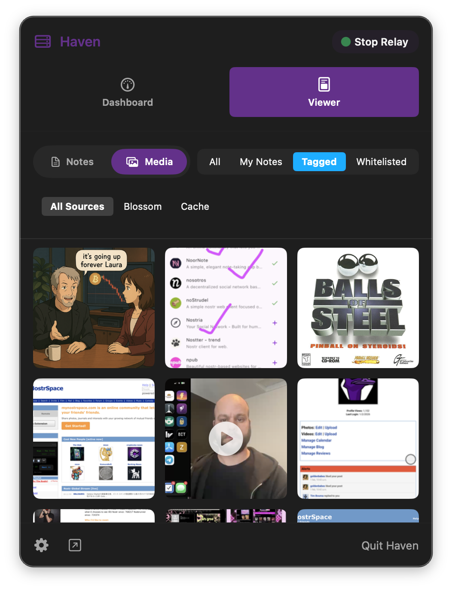
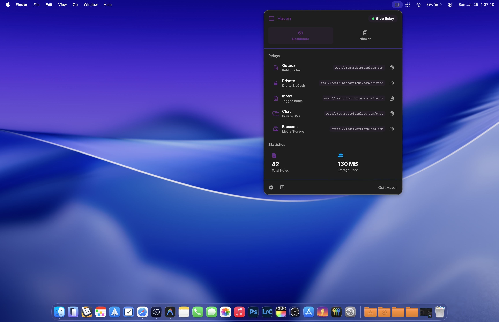

# HAVEN for Mac

<p align="center">
  
</p>

<p align="center">
  <b>Your Personal Nostr Relay — Native on Mac</b><br>
  <i>Powered by the original Go codebase from <a href="https://github.com/bitvora/haven">bitvora/haven</a>.</i>
</p>

---

> [!IMPORTANT]
> **Installation Note**: Haven is currently unsigned code. macOS will likely block the application from opening by default. To bypass this, open **Settings → Privacy & Security**, scroll down to **Security**, and click **Open Anyway**.

> [!NOTE]
> **Coming Soon**: We are actively working toward **App Store & TestFlight distribution** using a new [C-shared relay architecture](docs/C_SHARED_RELAY.md) that compiles the Go backend directly into the Swift app as a single process.

## ✨ Features

- **Native Swift UI** — Fast, responsive, and designed for macOS. Lives in your menu bar.
- **Trusted Core** — Runs the exact same Go code as the CLI version, ensuring compatibility and security.
- **Easy Setup** — Drag-and-drop installation with a guided setup wizard. No command line required.
- **Private Relay** — Run your own Nostr relay effortlessly.
- **Notes Viewer** — View notes from your relay filtered by "My Notes", "Tagged", and "Whitelisted" contacts.
- **Media Viewer** — Browse images, videos, GIFs, and audio files with a full-screen viewer, keyboard navigation, and source filtering (Blossom vs Cache).
- **Audio Playback** — Play `.mp3`, `.wav`, `.m4a`, `.aac`, `.flac`, and `.ogg` files with a built-in player.
- **Blossom Media Server** — Integrated media hosting with smart MIME detection using magic bytes + relay metadata.
- **Access Control** — Manage whitelist and blacklist pubkeys from a dedicated settings tab.
- **JSONL Export/Import** — Back up and restore your notes locally via native save/open panels.
- **Dashboard Quick Actions** — Export JSONL, export Blossom media, and import notes directly from the dashboard.
- **Automatic Lock Recovery** — Detects database locks and recovers automatically.
- **Upstream Sync** — Stays in sync with the upstream [bitvora/haven](https://github.com/bitvora/haven) Go codebase via git subtree.

## 📺 Video Walkthrough

[Coming Soon]

## 📸 Screenshots

| Dashboard | Notes Viewer |
|:---:|:---:|
|  |  |

| Media Viewer | Full-Screen View |
|:---:|:---:|
|  |  |

## 🛠️ Building from Source

Don't trust, verify. You can build HAVEN for Mac entirely from source.

### Quick Start

1.  **Clone the repo:**
    ```bash
    git clone https://github.com/btcforplebs/haven-mac.git
    cd haven-mac
    ```

2.  **Build the Go backend:**
    ```bash
    cd haven-go && go build .
    ```

3.  **Open in Xcode and run:**
    ```bash
    open HavenApp/HavenApp.xcodeproj
    ```
    Press `Cmd + R` to build and run. Xcode automatically compiles the Go binary via `build_haven.sh` and bundles it into the app.

For detailed instructions, see [BUILD_MAC.md](docs/BUILD_MAC.md) and [VERIFY_BUILD.md](docs/VERIFY_BUILD.md).

## 📂 Project Structure

| Directory | Description |
|-----------|-------------|
| `haven-go/` | The upstream Go relay source (managed via git subtree) |
| `HavenApp/` | The native Swift macOS application |
| `docs/` | Documentation and guides |

## 📖 Documentation

- [**CHANGELOG**](CHANGELOG.md) — Full version history
- [**Release Process**](docs/RELEASE_PROCESS.md) — How to cut a new release
- [**Upstream Sync**](docs/upstream-sync.md) — How to pull upstream Go changes
- [**C-Shared Relay Architecture**](docs/C_SHARED_RELAY.md) — The upcoming single-process architecture for App Store distribution
- [**Build & Verify**](docs/BUILD_MAC.md) — Building from source and verifying binaries
- [**Access Control**](docs/access-control.md) — Configuring whitelist and blacklist

## Credit

Built on top of the incredible work by [bitvora](https://github.com/bitvora/haven).
