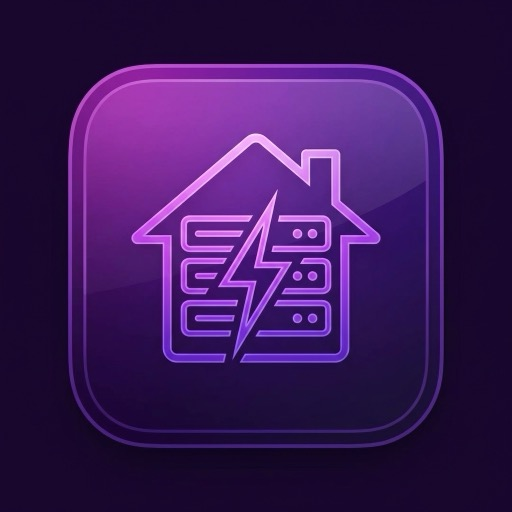
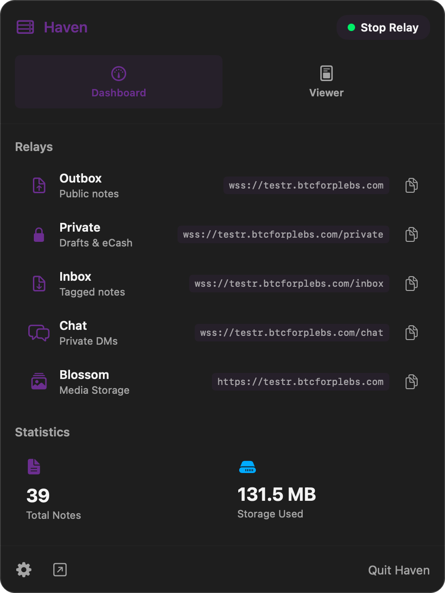
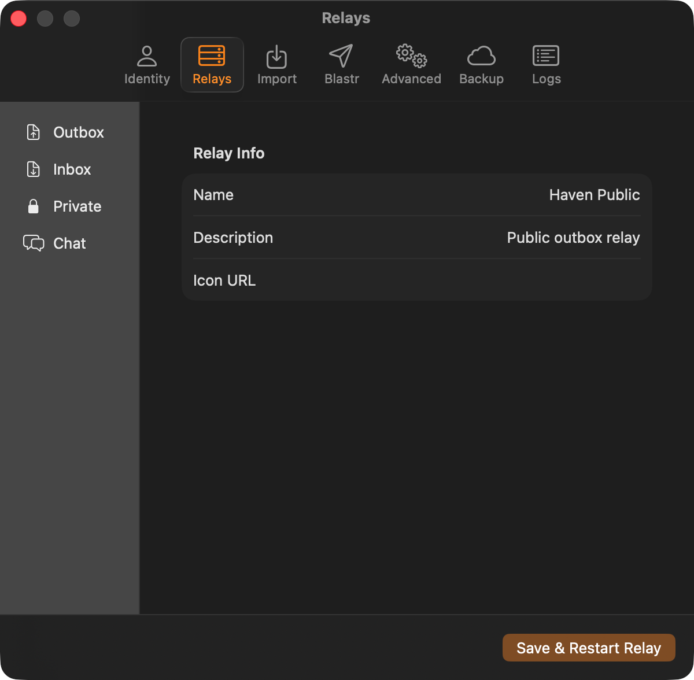

# HAVEN for Mac

<p align="center">
  
</p>

<p align="center">
  <b>The Native Mac Experience for HAVEN</b><br>
  <i>Powered by the original Go codebase.</i>
</p>

---

**HAVEN for Mac** brings the power of [HAVEN](https://github.com/bitvora/haven) to your desktop with a beautiful, native Swift interface. It combines the performance and reliability of the original Go implementation (100% of the code!) with a seamless macOS experience.

## ✨ Features

- **Native Swift UI**: Fast, responsive, and designed for macOS.
- **Trusted Core**: Runs the exact same Go code as the CLI version, ensuring compatibility and security.
- **Easy Setup**: Drag-and-drop installation. No command line required.
- **Private Relay**: Run your own Nostr relay effortlessly.

## 📺 Video Walkthrough

[Coming Soon]

## 📸 Screenshots

| Dashboard | Settings |
|:---:|:---:|
|  |  |


## 🛠️ Verification & Building

Don't trust, verify. You can build HAVEN for Mac entirely from source, or just compile the Go backend yourself to ensure integrity.

### Quick Start (Build from Source)

1.  **Clone the repo:**
    ```bash
    git clone https://github.com/btcforplebs/haven-mac.git
    cd haven-mac
    ```

2.  **Build the Go Backend:**
    ```bash
    cd haven-go && go build .
    ```

3.  **Open in Xcode:**
    ```bash
    open HavenApp/HavenApp.xcodeproj
    ```

For detailed instructions on verifying the Go binary, building from source, and installing, see [VERIFY_BUILD.md](docs/VERIFY_BUILD.md).

## 📂 Project Structure

- **`haven-go/`**: The original Go source code (backend).
- **`HavenApp/`**: The native Swift application (frontend).
- **`docs/`**: Documentation and guides.

## Credit

Built on top of the incredible work by [bitvora](https://github.com/bitvora/haven).
