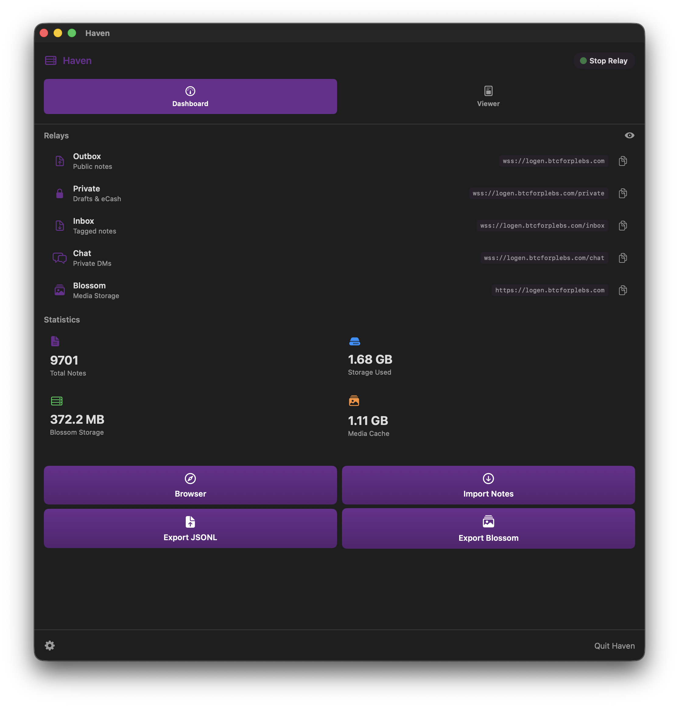
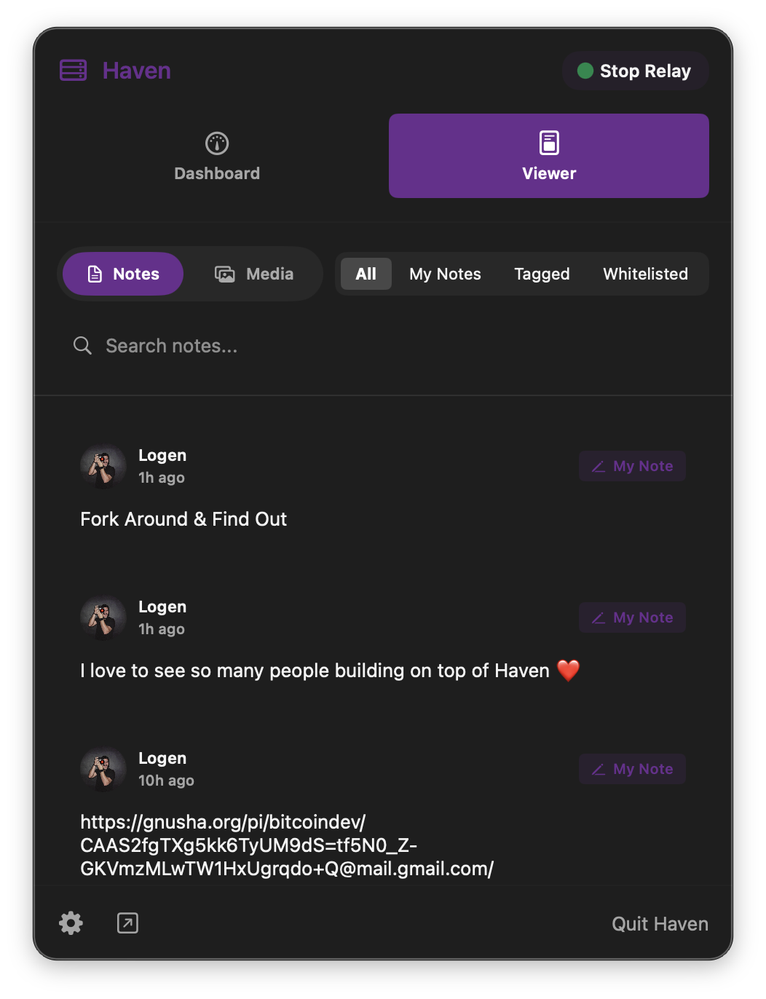

# HAVEN - Native Mac & iOS

<p align="center">
  
</p>

<p align="center">
  <b>Your Personal Nostr Relay — Native on Mac & iOS</b><br>
  <i>Powered by the original Go codebase from <a href="https://github.com/bitvora/haven">bitvora/haven</a> and forked enhancements from <a href="https://github.com/barrydeen/haven">barrydeen/haven</a>.</i>
</p>

---

> [!TIP]
> **Join the Beta**: Haven for iOS is now available on **TestFlight**! [**Click here to join the beta**](https://testflight.apple.com/join/kN3zE1H1).

> [!IMPORTANT]
> **macOS Installation Note**: Haven is currently unsigned code. macOS will likely block the application from opening by default. To bypass this, open **Settings → Privacy & Security**, scroll down to **Security**, and click **Open Anyway**.

## ✨ Features

- **Native SwiftUI** — Fast, responsive, and designed for macOS and iOS.
- **Trusted Core** — Runs the exact same battle-tested Go code as the CLI relay, ensuring 100% compatibility.
- **Mac-to-iOS Sync** — Use your Mac as your always-on home base. Haven for iOS securely syncs missed notes directly from your Mac relay.
- **Nostr Zaps & NWC** — Integrated Lightning wallet support via Nostr Wallet Connect (NWC). Send and receive zaps instantly with real-time balance tracking.
- **Private Relay** — Run your own private Nostr relay effortlessly from your desktop or phone.
- **Smart Broadcasting** — Haven automatically discovers your recipient's preferred relays and broadcasts directly to their inbox.
- **Advanced Access Control** — Multi-pubkey whitelisting and blacklisting support for refined relay privacy.
- **Media Viewer** — Browse images, videos, GIFs, and audio files with source filtering (Blossom vs Cache).
- **Blossom Media Server** — Integrated BUD-02 media hosting with automatic mirroring and smart MIME detection.
- **JSONL Backup/Restore** — Comprehensive backup system using a portable JSONL format with cloud backup support.
- **Web of Trust (WoT)** — Built-in WoT with configurable depth and periodic refresh mechanisms.
- **Privacy First** — Secured by system-level Keychain. Encrypt your private key with NIP-49 (using ncryptsec).

## ⚙️ Divergence from Upstream

This fork introduces several architectural changes and features to support native macOS and iOS integration:

- **C-Shared Library Architecture** — Go relay compiled as a static library linked directly into the Swift binary.
- **Multi-Relay Dynamic Handler** — Handles four distinct relays (**Private, Chat, Inbox, Outbox**) within a single process.
- **barrydeen/haven Enhancements** — Multi-pubkey whitelisting, blacklisting, JSONL backups, and persistent WoT.
- **Mobile & Sandbox Fixes** — Specialized file loading for macOS and memory optimizations for iOS.

For the full technical breakdown, see [**DIVERGENCE.md**](docs/DIVERGENCE.md).

## 📺 Video Walkthrough

[Coming Soon]

## 📸 Screenshots

| Mac Dashboard | Notes Viewer | iOS Dashboard |
|:---:|:---:|:---:|
|  |  |  |

## 🛠️ Building from Source

Don't trust, verify. You can build HAVEN entirely from source.

### Quick Start (macOS)

1.  **Clone the repo:**
    ```bash
    git clone https://github.com/btcforplebs/haven-mac.git
    cd haven-mac
    ```

2.  **Build the Go backend:**
    ```bash
    cd haven-go && go build .
    ```

3.  **Open in Xcode and run:**
    ```bash
    open HavenApp/HavenApp.xcodeproj
    ```
    Press `Cmd + R` to build and run. Xcode automatically compiles the Go static library via `build_haven.sh`.

For detailed instructions, see [BUILD_MAC.md](docs/BUILD_MAC.md), [BUILD_IOS.md](docs/BUILD_IOS.md), and [VERIFY_BUILD.md](docs/VERIFY_BUILD.md).

## 📂 Project Structure

| Directory | Description |
|-----------|-------------|
| `haven-go/` | The upstream Go relay source (forked from barrydeen/haven) |
| `HavenApp/` | The native Swift macOS and iOS application |
| `docs/` | Documentation and guides |
| `website/` | Sources for the [havennostr.com](https://havennostr.com) landing page |

## 📖 Documentation

- [**CHANGELOG**](CHANGELOG.md) — Full version history
- [**C-Shared Relay Architecture**](docs/C_SHARED_RELAY.md) — How we bundle Go into Swift
- [**Build & Verify**](docs/BUILD_MAC.md) — Building from source and verifying binaries
- [**Sync Guide**](docs/upstream-sync.md) — Staying in sync with upstream changes

## Credit

Built on top of the incredible work by [bitvora](https://github.com/bitvora/haven) and [barrydeen](https://github.com/barrydeen/haven).
