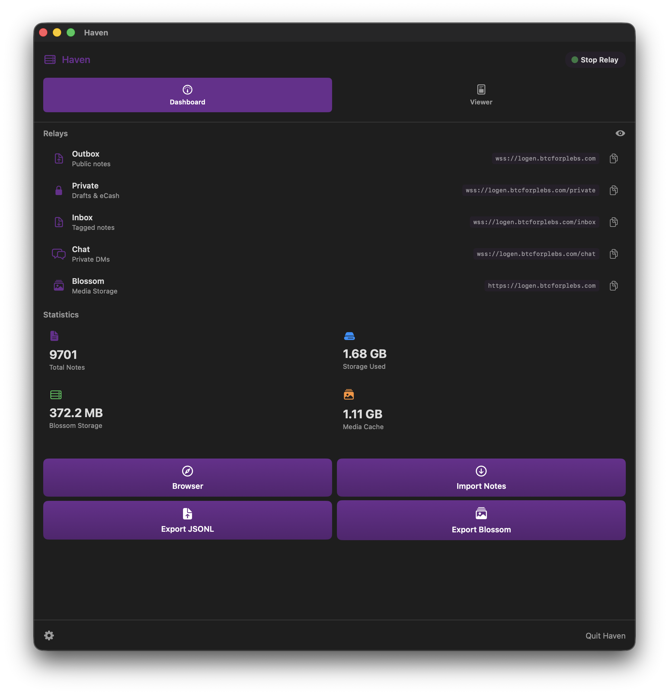
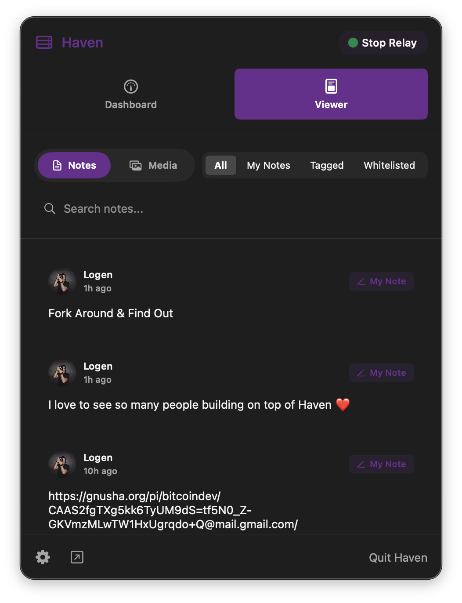

# Nostr Vault - Native Mac & iOS

<p align="center">
  
</p>

<p align="center">
  <b>Your Personal Nostr Relay — Native on Mac & iOS</b><br>
  <i>Powered by the original Go codebase from <a href="https://github.com/bitvora/Nostr Vault">bitvora/Nostr Vault</a> and forked enhancements from <a href="https://github.com/barrydeen/haven">barrydeen/haven</a>.</i>
</p>

---

> [!TIP]
> **Join the Beta**: Nostr Vault for iOS is now available on **TestFlight**! [**Click here to join the beta**](https://testflight.apple.com/join/kN3zE1H1).

> [!IMPORTANT]
> **macOS Installation Note**: Nostr Vault is currently unsigned code. macOS will likely block the application from opening by default. To bypass this, open **Settings → Privacy & Security**, scroll down to **Security**, and click **Open Anyway**.

## ✨ Features

### Core
- **Native SwiftUI** — Fast, responsive, and designed for macOS and iOS.
- **Trusted Core** — Runs the exact same battle-tested Go code as the CLI relay, ensuring 100% compatibility.
- **Private Relay** — Run your own private Nostr relay effortlessly from your desktop or phone.
- **Mac-to-iOS Sync** — Use your Mac as your always-on home base. Nostr Vault for iOS securely syncs missed notes directly from your Mac relay.
- **Multi-Account Support** — Switch between multiple Nostr accounts with clean subscription teardown, per-account data isolation, and instant feed restoration from disk snapshots.
- **Privacy First** — Secured by system-level Keychain. Encrypt your private key with NIP-49 (ncryptsec). NIP-46 remote signing via `bunker://` URIs for hardware-separated key management.

### Messaging
- **NIP-17 Private DMs** — End-to-end encrypted messaging with the NIP-17 gift wrap protocol (NIP-44 ChaCha20 + HMAC-SHA256). Three-layer privacy: rumor, seal, gift wrap with ephemeral keypairs and randomized timestamps.
- **NIP-04 Legacy Support** — Backward-compatible NIP-04 DMs with per-conversation protocol toggle and visual warnings.
- **DM Inbox & Threads** — Full conversation list with unread indicators, gradient chat bubbles, mark-all-as-read, and real-time message arrival.

### Payments
- **Lightning Wallet (NWC)** — Send and receive zaps via Nostr Wallet Connect with real-time balance, invoice generation with QR codes, and custom zap amounts/messages.
- **Cashu Ecash Wallet** — Full NUT protocol ecash wallet with Blind Diffie-Hellman key exchange. Deposit/withdraw via Lightning (NUT-04/05), send/receive cashuA tokens (NUT-00/03), and relay-backed storage via NIP-60 with NIP-44 self-encryption for cross-device recovery.
- **On-Chain Bitcoin** — Taproot (BIP-341) address derivation, UTXO sweeping with Schnorr signatures, and selectable fee rates via Mempool API.

### Feed & Content
- **Smart Broadcasting** — Automatically discovers recipient preferred relays (kind 10002/10050) and broadcasts to their inbox.
- **Feed Dashboard** — Centralized control panel with connection status, 4-card stats grid, feed mode selector (Following/Discovery/Global/Media), content filter toggles, relay health, and quick actions.
- **Link Preview Cards** — Rich inline URL previews with OpenGraph metadata fetching, memory/disk caching, and request coalescing.
- **Infinite Scroll** — Automatic pagination in both the main feed and profile note feeds with timestamp cursor-based relay queries.
- **120fps Feed Performance** — Data-driven FeedNoteRow with pre-resolved Equatable structs, cached filtered notes, compiled regex patterns, and NSCache-backed attributed string formatting.
- **Feed Page (Web)** — Go-powered HTML feed page for web access to your relay content.

### Media
- **Blossom Media Server** — Integrated BUD-02 media hosting with automatic mirroring, BUD-06 preflight checks, and smart MIME detection via magic bytes.
- **Media Viewer** — Browse images, videos, GIFs, and audio with source filtering, glassmorphic playback controls, hardware keyboard shortcuts, and shared video player pool.
- **Media Grid Tab** — Instagram-style 3-column grid with tap-to-open carousel, long-press note details, and video thumbnail caching.
- **Paste & Upload** — Paste images or URLs directly into the media viewer or compose flow for instant Blossom upload.

### Social
- **Following List Backup & Recovery** — Automatic contact list snapshots (up to 50 per account) with relay recovery scanning, chronological display, delta badges, per-user re-follow, and full list restore.
- **Bidirectional Mute List Sync** — Kind 10000 mute list events fetched and published to relays with per-account block lists.
- **@mention Tagging** — Live-filtered follower popup in compose with automatic npub token insertion and p-tag routing.
- **NIP-10/18/25 Compliance** — Proper reply threading with root/reply e-tag markers, quote post tags with relay hints, and reaction events with kind tags.

### Notifications
- **On-Device Notifications** — DMs, mentions, replies, zaps, reactions, and reposts, generated on-device from your own relay's event stream. No push server, no APNs, no third party. Per-account granular toggles by event type.
- **Zap Notification Banner** — Animated floating status pills with real-time feedback (Zapping, Zapped, Failed).

### Infrastructure
- **Advanced Access Control** — Multi-pubkey whitelisting, blacklisting, and per-account block lists synced to the Go relay.
- **Web of Trust (WoT)** — Built-in WoT with configurable depth, minimum followers, refresh intervals, and 72-hour cache TTL.
- **JSONL Backup/Restore** — Portable JSONL export/import with cloud backup support.

## ⚙️ Divergence from Upstream

This fork introduces several architectural changes and features to support native macOS and iOS integration:

- **C-Shared Library Architecture** — Go relay compiled as a static library linked directly into the Swift binary.
- **Multi-Relay Dynamic Handler** — Handles four distinct relays (**Private, Chat, Inbox, Outbox**) within a single process.
- **barrydeen/haven Enhancements** — Multi-pubkey whitelisting, blacklisting, JSONL backups, and persistent WoT.
- **Mobile & Sandbox Fixes** — Specialized file loading for macOS and memory optimizations for iOS.

For the full technical breakdown, see [**DIVERGENCE.md**](docs/DIVERGENCE.md).

## 📺 Video Walkthrough

[Coming Soon]

## 📸 Screenshots

| Mac Dashboard | Notes Viewer | iOS Dashboard |
|:---:|:---:|:---:|
|  |  |  |

## 🛠️ Building from Source

Don't trust, verify. You can build HAVEN entirely from source.

### Quick Start (macOS)

1.  **Clone the repo:**
    ```bash
    git clone https://github.com/btcforplebs/haven-mac.git
    cd haven-mac
    ```

2.  **Build the Go backend:**
    ```bash
    cd haven-go && go build .
    ```

3.  **Open in Xcode and run:**
    ```bash
    open HavenApp/HavenApp.xcodeproj
    ```
    Press `Cmd + R` to build and run. Xcode automatically compiles the Go static library via `build_haven.sh`.

For detailed instructions, see [BUILD_MAC.md](docs/BUILD_MAC.md), [BUILD_IOS.md](docs/BUILD_IOS.md), and [VERIFY_BUILD.md](docs/VERIFY_BUILD.md).

## 📂 Project Structure

| Directory | Description |
|-----------|-------------|
| `haven-go/` | The upstream Go relay source (forked from barrydeen/haven) |
| `HavenApp/` | The native Swift macOS and iOS application |
| `docs/` | Documentation and guides |
| `website/` | Sources for the [havennostr.com](https://havennostr.com) landing page |

## 📖 Documentation

- [**CHANGELOG**](CHANGELOG.md) — Full version history
- [**C-Shared Relay Architecture**](docs/C_SHARED_RELAY.md) — How we bundle Go into Swift
- [**Build & Verify**](docs/BUILD_MAC.md) — Building from source and verifying binaries
- [**Sync Guide**](docs/upstream-sync.md) — Staying in sync with upstream changes

## Credit

Built on top of the incredible work by [bitvora](https://github.com/bitvora/haven) and [barrydeen](https://github.com/barrydeen/haven).
